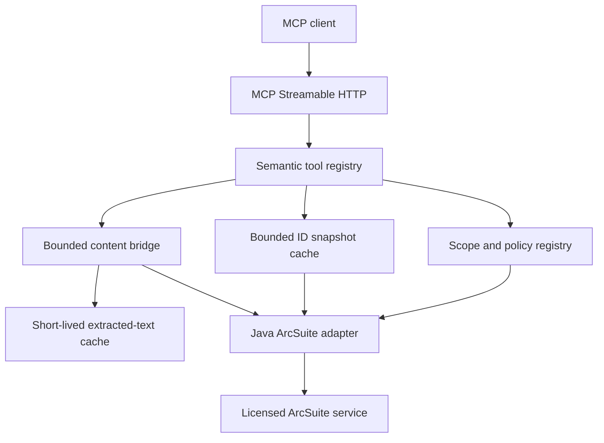

# ArcSuite MCP Server

ArcSuite MCP Server is a generic, read-only semantic MCP gateway for a
licensed FUJIFILM ArcSuite Web Service Interface. It lets MCP-compatible AI
clients discover configured document scopes, search and page through results,
inspect metadata, list folders and revisions, batch-read document metadata,
read bounded text from document content, and check document integrity.

This is an independent open-source project. It is not affiliated with or
endorsed by FUJIFILM Business Innovation. See [NOTICE.md](NOTICE.md).

## What it provides

- v1.0 R1 Core Read: document search, semantic attribute filters, metadata,
  paths, folder listing, and revision listing;
- v1.0 R2 Content Read: SOAP/MTOM retrieval through a Java adapter, safe text
  extraction, size/character bounds, and signed cursors;
- v1.1 Read UX & Efficiency: profile-aware capability discovery, stable bounded
  search/folder paging, batch metadata reads, short-lived extracted-content
  reuse, and optional trusted ArcSuite UI deep links;
- v1.2 S1 Typed Search Foundation: schema-validated typed semantic predicates,
  enum aliases, and scope-configured full-text modes;
- v1.2 S2 Content Labels: operator-configured semantic content-label aliases,
  metadata membership proof, label-isolated extraction caches, and
  label-bound read cursors;
- v1.2 S3 Hard References: opt-in, single-hop incoming relationship discovery,
  candidate authorization before paging, and semantic results without physical
  relationship IDs;
- v1.2 S4 Document Integrity: per-scope opt-in validation and optional
  already-calculated evidence availability, with conservative status mapping;
- current MCP Streamable HTTP through the official TypeScript SDK, with a
  stateless legacy compatibility path for older 2025-era clients;
- server-side scope mapping, token profiles, rate limits, audit metadata, and
  mechanical read-only operation checks.

The v1.0 through v1.2 surface has ten semantic tools; each profile sees only
the tools it allows:

`arcsuite_describe_capabilities`, `arcsuite_search_documents`,
`arcsuite_get_document`, `arcsuite_get_documents`, `arcsuite_list_folder`,
`arcsuite_list_document_revisions`, `arcsuite_get_document_content_info`,
`arcsuite_read_document`, `arcsuite_list_hard_references`, and
`arcsuite_validate_document_integrity`.

See [docs/tools.md](docs/tools.md) for integrity validation, typed predicates,
full-text modes, relationship reads, paging, batch-read, cache, and deep-link
behavior. S1–S4 implementation is present and covered by synthetic tests. The
F1–F7 closure remediation has passed the complete local validation suite;
independent final cross-cutting re-audit and live ArcSuite qualification remain
pending.

## Architecture



The project is **not a generic ArcSuite SOAP proxy**. MCP callers do not
provide an ArcSuite endpoint, cabinet ID, physical Attribute ID, WSDL, SOAP
operation, credential, or session identifier. Those values stay in operator
configuration and the adapter.

## Prerequisites

- Node.js 22.6 or newer;
- Python 3 for bounded OOXML extraction;
- `pdftotext` for PDF extraction;
- Java 17 JDK or newer for the optional SOAP/MTOM adapter;
- ArcSuite Web Service Interface documentation and a WSDL obtained from the
  operator's licensed environment for a real deployment.

Vendor material is not included. See
[docs/vendor-references.md](docs/vendor-references.md).

## Quick start with the synthetic adapter

The mock mode never contacts ArcSuite and uses only synthetic documents:

```sh
npm ci
MCP_DEV_BEARER_TOKEN=local-example-token npm run dev
```

The endpoint listens on `http://127.0.0.1:8080/mcp`. A minimal request is:

```sh
curl -sS http://127.0.0.1:8080/mcp \
  -H 'Authorization: Bearer local-example-token' \
  -H 'Content-Type: application/json' \
  -H 'Accept: application/json, text/event-stream' \
  -H 'MCP-Protocol-Version: 2025-03-26' \
  --data '{"jsonrpc":"2.0","id":1,"method":"tools/call","params":{"name":"arcsuite_search_documents","arguments":{"scope":"example_documents","filters":{"document_number":"DOC-000001"}}}}'
```

For an operator deployment, copy the example files to ignored local paths,
replace every placeholder with values verified in the licensed environment,
and run the Java adapter in a private network. See
[docs/getting-started.md](docs/getting-started.md) and
[docs/deployment.md](docs/deployment.md).

## Configuration

The semantic registry is the safe place to map public names to environment-
specific ArcSuite schema. Start with [config/scopes.example.yaml](config/scopes.example.yaml):

```yaml
version: 1
scopes:
  example_documents:
    description: "Example document repository"
    enabled: true
    arcsuite:
      cabinet_alias: "EXAMPLE_CABINET"
      cabinet_id: "rep:YOUR_SERVICE:YOUR_CABINET"
      root_object_id: null
      resolve_references: true
    # Optional labels are semantic aliases for callers. The physical mapping
    # is operator configuration and is never returned through MCP.
    # content_labels:
    #   preview:
    #     ns: "rep"
    #     name: "user:YOUR_PREVIEW_CONTENT_LABEL"
    # Optional convenience; the host/template remain server-side.
    # ui:
    #   document_url_template: "https://arcsuite.example.invalid/open?id={document_id}"
    allowed_object_types: [document, folder, reference]
    default_attr_ids:
      - {ns: "rep", name: "system:name"}
    search:
      full_text_modes: [none]
    semantic_attributes:
      document_number:
        attr_id: {ns: "rep", name: "user:YOUR_DOCUMENT_NUMBER_ATTRIBUTE"}
        type: string
        operators: [eq, like]
```

The endpoint and credentials are environment or secret-file configuration,
never MCP tool arguments. Token profiles are hashes of bearer tokens; use
`npm run hash-token -- 'a-local-token'` for local setup and keep the resulting
token configuration out of version control.

v1.1 paging/content caches are process-local and bounded by configuration.
They do not expand ArcSuite authority, are isolated by client profile/scope,
and never write extracted document text to the audit log. S2 content snapshots
also include the semantic label and exact physical namespace/name in their
private identity.

v1.2 typed filter values are validated against the configured ArcSuite schema.
Explicit predicates use only the small semantic operator matrix documented in
[docs/tools.md](docs/tools.md); enum aliases hide physical values. `none` is the
default full-text mode, while `stemming` and `thesaurus` require explicit
scope configuration.

S2 content reads accept semantic aliases such as `system:primary` (the default)
and an operator-configured `preview`; callers cannot submit a physical
namespace/name pair. The selected object or revision must advertise the exact
namespace and name in `rep:system:contentlabellist` before content is fetched.

See [docs/configuration.md](docs/configuration.md) for all important bounds
and [config/tokens.example.json](config/tokens.example.json) for a synthetic
profile.

## MCP client example

Client configuration varies by product. A generic illustrative shape is:

```json
{
  "mcpServers": {
    "arcsuite": {
      "url": "https://mcp.example.invalid/mcp",
      "headers": {
        "Authorization": "Bearer ${ARCSUITE_MCP_TOKEN}"
      }
    }
  }
}
```

The MCP endpoint is the only endpoint an AI client should reach. A Dify
example, including self-hosted networking and SSRF-proxy guidance, is isolated
under [docs/integrations/dify.md](docs/integrations/dify.md) and
[examples/dify/README.md](examples/dify/README.md).

## Supported content types

The content bridge currently supports text, CSV, JSON, XML, PDF, DOCX, XLSX,
and PPTX extraction where the corresponding local runtime is available.
XML DTD/external entities are rejected. OOXML archive paths, file counts,
decompression, member sizes, and extracted characters are bounded. Macros and
embedded objects are not executed. DocuWorks/XDW is intentionally unsupported
in v1.x and fails safely unless a future optional provider is explicitly
configured. No normal MCP tool returns binary or base64 content.

## Security philosophy and non-goals

Read-only is enforced at several layers: tool definitions, input validation,
semantic scope checks, the SOAP operation allowlist, adapter dispatch, and
tests. Administrator mode, privilege assertion, privileged-print retrieval,
ACL mutation, hard delete, workflow termination, delegated workflow execution,
arbitrary SOAP operations, and arbitrary endpoint/cabinet/schema input are not
v1.x capabilities.

The v1.1 ID-only paging operations and multi-object metadata read are themselves
read-only and remain behind the same semantic scope checks. Paging/content
caches are performance features, not authorities.

Future governed mutations, if ever added, require explicit human approval and
workflow-controlled execution. Business mutation retry remains zero.

## Development and testing

```sh
npm ci
npm run typecheck
npm test
npm run check:invariants
npm run check:hygiene
python3 -m py_compile scripts/ooxml_extract.py
(cd adapter-java && ./compile.sh && ./selftest.sh)
```

The repository's GitHub workflows run the same checks plus dependency and
CodeQL jobs. Tests use synthetic fixtures. A passing local test suite is not a
claim of qualification against a real ArcSuite server or a particular AI
client; see [docs/compatibility.md](docs/compatibility.md).

## License

MIT. See [LICENSE](LICENSE).
