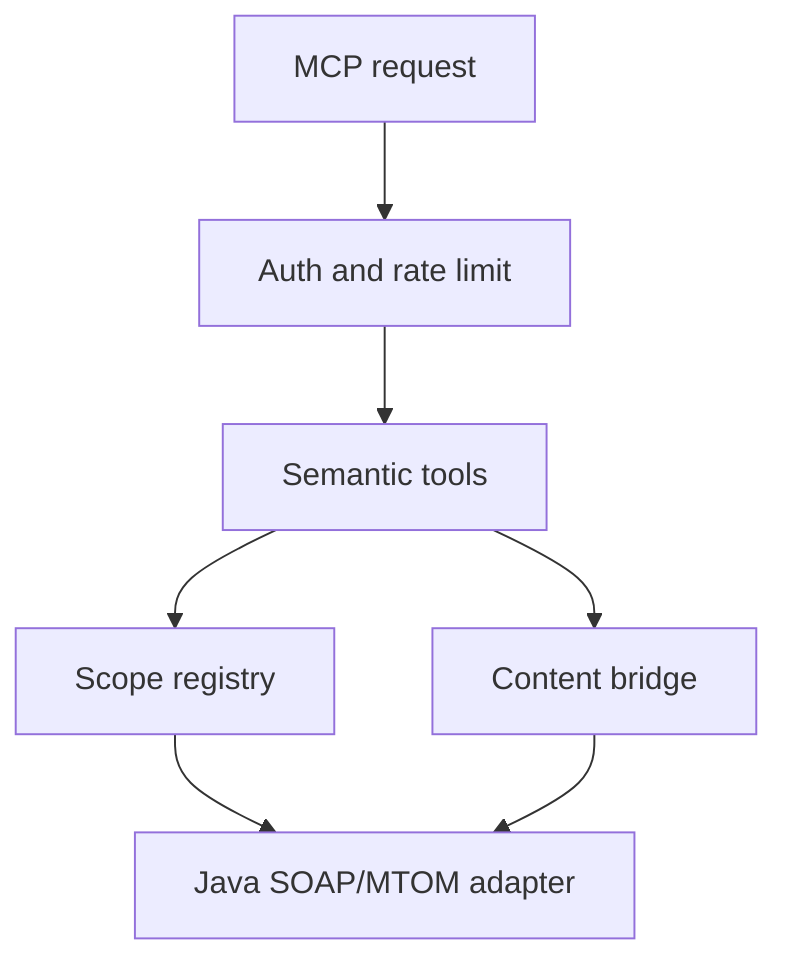

# Architecture

ArcSuite MCP Server is intentionally split into a semantic TypeScript gateway,
a bounded content bridge, and a private Java adapter.

## Boundaries

### MCP gateway

`src/server.ts` wires configuration, scopes, sessions, content limits, audit,
and the tool registry. `src/mcp/protocol.ts` uses the official MCP TypeScript
SDK and Node adapter for Streamable HTTP. It validates Host and Origin before
authentication and does not derive credentials from tool arguments.

### Semantic layer

`src/mcp/tools.ts` exposes nine generic tools. It translates semantic scope and
filter names into adapter requests, proves that object IDs belong to an
allowed configured scope, and shapes results without returning the raw
physical attribute map.

Incoming Hard Reference discovery is enabled per semantic scope. Candidate
IDs are bounded and authorized for cabinet, root, and object type before they
enter the paging snapshot. The adapter keeps Hard Reference identities and
reference-target proof data private; MCP results contain only safe semantic
relationship metadata.

`config/scopes.example.yaml` describes the mapping. Each operator supplies a
separate ignored registry after checking its own ArcSuite schema.

### Content bridge

`src/content/` accepts only adapter-produced files in a private shared
directory. It selects a known extractor, bounds bytes and extracted
characters, rejects unsafe XML/archive input, creates signed cursors, and
deletes the file on every read/discard path.

### Java adapter

`adapter-java/` owns SOAP request construction, the ArcSuite Session header,
RSA PKCS#1 v1.5 encrypted login, session refresh, MTOM parsing, and response
materializing.
It exposes internal HTTP routes only to the TypeScript gateway. The Java
client checks its read-only SOAP allowlist before dispatch.

## Request flow

1. The HTTP server validates the Host and, when present, Origin hostname.
2. A bearer token is matched by SHA-256 against a configured profile.
3. The profile limits scopes, tools, and request rate.
4. The semantic tool validates public arguments and rejects raw ArcSuite
   fields.
5. For a content cache miss, the selected document or exact revision is
   fetched with the content-label-list attribute and scope/root/object-type
   proof; only an exact namespace/name membership match may continue.
6. The session manager invokes only bounded read operations.
7. The adapter performs ArcSuite-specific SOAP/MTOM work internally and
   verifies the returned content label identity.
8. The gateway returns semantic JSON and bounded text, never credentials,
   session identifiers, raw SOAP, or ordinary binary/base64.

## Failure boundary

Errors are mapped to stable categories such as invalid argument, forbidden,
unsupported content, session expired, unavailable, limit exceeded, timeout,
and upstream error. Error responses do not include upstream SOAP text or
private configuration details.
