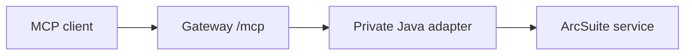

# Deployment

## Process layout

Run the TypeScript MCP gateway and Java ArcSuite adapter as separate services.
The adapter should be reachable only from the gateway's private network. The
MCP endpoint should be behind TLS and, where appropriate, an external identity
or network authentication layer.



## P1/P2 opaque-ref topology boundary

P1/P2 opaque refs and ref-native operations are supported only when the operator has verified that the MCP
gateway runtime count is exactly one. The handle store is process-local and is
not shared with another gateway process. Restart, replacement, or deployment
invalidates every outstanding ref; clients recover by running the semantic
search again.

Multi-replica routing, rolling overlap, sticky-session guarantees, and
cross-instance ref resolution are not supported. Do not enable
`MCP_OPAQUE_REFS_ENABLED` on a multi-replica deployment. A shared HandleStore
backend is future additive HA work and is not part of P1/P2.

The checked-in Compose and Podman templates remain legacy-only by default and
do not mount a handle keyring. An operator enabling opaque refs must add a
separate mode-600 keyring secret, mount it only in the single gateway, and set
`MCP_OPAQUE_REF_KEYS_JSON_FILE` to that mount. It must not reuse the cursor HMAC
file or place key material in `.env`.

## Docker Compose example

docker-compose.example.yml is a public, synthetic template for the
two-container deployment. Copy it to the ignored operator-owned
docker-compose.yml; do not copy a licensed live Compose file into the
repository:

    cp docker-compose.example.yml docker-compose.yml
    cp .env.compose.example .env
    cp config/scopes.example.yaml config/scopes.yaml
    mkdir -p local-secrets
    chmod 700 local-secrets

The Compose-specific `.env.compose.example` is intentionally separate from
`.env.example`, which documents direct/local/mock development. In the local
ignored `.env`, set at least `ARCSUITE_SOAP_ENDPOINT`, `ARCSUITE_USERNAME`,
`IMAGE_TAG`, and `ARCSUITE_MCP_SOURCE_REVISION`. Do not put the ArcSuite
password or bearer-token plaintext in `.env`. Review the optional bounds and
settings in the Compose file and provide any target-environment hostname,
bind, TLS, audit-path, or reverse-proxy values there.

The Compose file uses normal .env interpolation and maps only the environment
variables required by each service. It does not inject the full .env into both
containers: the gateway receives its adapter URL, scope path, bounded MCP
settings, and secret-file paths, while the adapter receives the ArcSuite
endpoint and username plus its own bounded adapter settings. The gateway never
receives adapter-only endpoint or username values, and the adapter never
receives gateway client-token or cursor-HMAC values.

The public template intentionally omits
`MCP_PAGING_MAX_TOTAL_IDS_PER_CLIENT`, so the runtime derives its bounded
default from the global and per-snapshot limits. An operator who needs an
explicit override must add its environment mapping to the ignored local
Compose file and validate it against the global ID budget; do not copy a fixed
derived value into the public template.

Populate these four operator-owned files under local-secrets/:

| Local file | Mounted path | Service |
| --- | --- | --- |
| arcsuite_adapter_internal_token | /run/secrets/arcsuite_adapter_internal_token | Gateway and adapter |
| arcsuite_cursor_hmac_secret | /run/secrets/arcsuite_cursor_hmac_secret | Gateway |
| arcsuite_client_tokens.json | /run/secrets/arcsuite_client_tokens_json | Gateway |
| arcsuite_password | /run/secrets/arcsuite_password | Adapter |

Generate the internal and cursor secrets through the approved local or secret
manager workflow. Prepare the client-token JSON from config/tokens.example.json
and replace its placeholder hash with a hash generated from a local bearer token
using npm run hash-token -- '<local bearer token>'. Obtain the ArcSuite password
file through the operator's approved secret workflow. Keep the four files mode
600:

    chmod 600 local-secrets/*

The default Compose network is a Compose-managed bridge named adapter. Both
services use it, the adapter port is only exposed to that network, and port
18080 is not published to the host. The network is not marked internal because
the adapter must retain outbound connectivity to the configured ArcSuite
service. The gateway binds to 127.0.0.1 on the host by default. If a reverse
proxy or another MCP client network is required, add a second operator-managed
network to the gateway in the local ignored Compose file and review TLS,
Host/Origin allowlists, and egress policy; the adapter can remain on the private
adapter network only.

The gateway and adapter use read-only root filesystems, /tmp tmpfs,
no-new-privileges, and dropped Linux capabilities. The named arcsuite-content
volume is mounted at /shared in both services for the bounded adapter/content
exchange. The scope file is mounted read-only. The gateway's metadata-only
audit output defaults to its writable /tmp tmpfs. `MCP_AUDIT_LOG_PATH` may
select another reviewed writable mount when the target environment requires
audit retention.

The default gateway-to-adapter URL is plain HTTP,
http://arcsuite-adapter:18080, because the Java adapter listener and the
live-tested topology use HTTP on the private Compose-managed bridge network.
The adapter port is not published to the host and the internal token remains
required, but this private-network boundary does not encrypt that hop. If the
container network cannot be treated as trusted, review TLS/mTLS or another
protected network boundary for the target environment. TLS/mTLS is not
configured or claimed as qualified by this generic example.

The gateway waits for the adapter to be started with
depends_on condition service_started. No unverified health endpoint is invented
here; the gateway performs its initial health/schema validation and retries a
failed startup validation every five seconds while /readyz remains 503. Once
validation succeeds, the retry is stopped and /readyz becomes authoritative.
Build and deployment provenance should start from a clean, reviewed source
revision. The revision label is metadata, not a substitute for source review
or an image signature. A representative operator flow is:

```sh
test -z "$(git status --short)"
git rev-parse HEAD
git rev-parse origin/main
export ARCSUITE_MCP_SOURCE_REVISION="$(git rev-parse HEAD)"
export IMAGE_TAG="$(git rev-parse --short=12 HEAD)"

docker compose --env-file .env -f docker-compose.yml config
docker compose --env-file .env -f docker-compose.yml build
docker image inspect "arcsuite-mcp-gateway:${IMAGE_TAG}" \
  --format '{{ index .Config.Labels "org.opencontainers.image.revision" }}'
docker image inspect "arcsuite-mcp-adapter:${IMAGE_TAG}" \
  --format '{{ index .Config.Labels "org.opencontainers.image.revision" }}'
docker compose --env-file .env -f docker-compose.yml up -d
docker compose --env-file .env -f docker-compose.yml images
docker compose --env-file .env -f docker-compose.yml ps
curl --fail http://127.0.0.1:8080/healthz
curl --fail http://127.0.0.1:8080/readyz
```

Require the inspected labels to equal the reviewed clean source revision, and
record the actual running image IDs from `docker compose images` before live
qualification. A deployment from a dirty tree or an `unknown` revision label
does not provide exact source provenance.

This example is based on a two-container topology exercised in a licensed live
ArcSuite environment. That evidence does not qualify this generic public
example for every Docker or Podman engine, operating system, network, reverse
proxy/TLS arrangement, secret-management integration, UID policy, or
deployment platform. Review those boundaries before use.

## Podman container example

`podman/podman-run.example.sh` is a template, not a production command. It
builds two images, mounts the operator-owned scope file read-only, mounts
secrets, and places the adapter on an internal network. Review every network
name, volume, UID, restart policy, and secret mechanism for the target
platform. The script fails before building if `config/scopes.yaml`, the four
named Podman secrets, or the required `ARCSUITE_SOAP_ENDPOINT`/
`ARCSUITE_USERNAME` variables are missing. The MCP token profile is supplied
only through the `mcp_tokens` Podman secret at runtime; do not create or mount
an ignored `config/tokens.json` file.

Set `IMAGE_TAG` and `ARCSUITE_MCP_SOURCE_REVISION` from the reviewed clean Git
revision before running the script. Both images receive the standard
`org.opencontainers.image.revision` label. Inspect that label and the running
container image IDs before health/readiness and live qualification; the label
does not itself prove the tree was clean or the image was signed.

The template expects these Podman secrets to exist before it is run:

| Secret | Mounted into | Purpose |
| --- | --- | --- |
| `arcsuite_password` | Java adapter | ArcSuite service-account password file |
| `adapter_token` | Both services | Gateway-to-adapter internal bearer token |
| `mcp_tokens` | Gateway | JSON file containing hashed MCP bearer-token profiles |
| `cursor_hmac` | Gateway | HMAC secret for signed read cursors |

Create them from operator-owned files outside the repository. For example:

```sh
mkdir -p local-secrets
chmod 700 local-secrets

# Copy the password from the operator's approved secret-management workflow.
install -m 600 /secure/operator/path/arcsuite-password.txt local-secrets/arcsuite_password

# Generate internal/cursor secrets locally, or obtain them from the secret manager.
openssl rand -hex 32 > local-secrets/adapter_token
openssl rand -hex 32 > local-secrets/cursor_hmac
chmod 600 local-secrets/adapter_token local-secrets/cursor_hmac

# Prepare a local token profile and replace its synthetic hash with a real
# locally generated hash. Keep this file out of version control.
cp config/tokens.example.json local-secrets/mcp_tokens.json

podman secret create arcsuite_password local-secrets/arcsuite_password
podman secret create adapter_token local-secrets/adapter_token
podman secret create mcp_tokens local-secrets/mcp_tokens.json
podman secret create cursor_hmac local-secrets/cursor_hmac
```

Secret names are examples and may need to be removed/recreated when rotated.
Do not put plaintext credentials, token values, or real ArcSuite mappings in
the repository or in MCP client configuration.

The root `Containerfile` includes Python and `pdftotext` for content
extraction. The Java `Containerfile` uses a Java 17 runtime. Do not copy WSDL,
manuals, SDKs, document samples, or real content into either image build
context.

Both Containerfiles use digest-pinned multi-platform base images. Keep the
human-readable tag and digest together, and review the upstream manifest
before changing either value:

| Image | Pinned reference |
| --- | --- |
| [Node.js official image](https://hub.docker.com/_/node) | `node:22.23.2-bookworm-slim@sha256:d649c27dae7ba0137b3cef5dd75baa422c08dc3d9e3fc0c23dfb172dc3cc6436` |
| [Eclipse Temurin official image](https://hub.docker.com/_/eclipse-temurin) (build) | `eclipse-temurin:17.0.20_8-jdk-jammy@sha256:ef4374b4b6b9d813dd3f5b593a35ec9a820cfb64a55994798147cc73435a0208` |
| [Eclipse Temurin official image](https://hub.docker.com/_/eclipse-temurin) (runtime) | `eclipse-temurin:17.0.20_8-jre-jammy@sha256:e17d77fb030dd4b642dc078d048a5fb9efcb3676ee20305d905949105a6ccd5a` |

The root build uses `.dockerignore`; the Java build uses
`adapter-java/.dockerignore` because its context is that directory. Do not
disable either ignore file or place operator-owned WSDL, SDK, secret, trace,
or document files under a build context.

The Java container binds its internal listener to `0.0.0.0` only so the
gateway can reach it through the private container network. The Podman example
does not publish port `18080` to the host. Outside a container network, keep
the adapter's default bind address at `127.0.0.1`.

## Network controls

- expose only `/mcp` to the intended MCP client network;
- keep `/healthz` and `/readyz` on the controlled service network where
  possible;
- keep the Java adapter's internal port private;
- configure `MCP_ALLOWED_HOSTNAMES` and `MCP_ALLOWED_ORIGIN_HOSTNAMES` with
  the actual service hostnames;
- if an outbound SSRF proxy is used, allow only the MCP service destination,
  never every private IP range;
- use TLS at the gateway or a trusted reverse proxy and avoid forwarding
  bearer tokens to unrelated upstreams.

## Files and permissions

Use mode-600 token/cursor/credential files and a mode-700 shared content
directory. Store audit output where only the service account and designated
operators can read it. Backups must follow the same data-minimization policy.

## Readiness

`/healthz` reports process/adapter health. `/readyz` reports startup
configuration and schema validation without returning the underlying error
message. A real deployment should keep readiness false until its scope schema
and ArcSuite version checks succeed.
