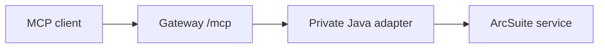

# Deployment

## Process layout

Run the TypeScript MCP gateway and Java ArcSuite adapter as separate services.
The adapter should be reachable only from the gateway's private network. The
MCP endpoint should be behind TLS and, where appropriate, an external identity
or network authentication layer.



## Container example

`podman/podman-run.example.sh` is a template, not a production command. It
builds two images, mounts the operator-owned scope file read-only, mounts
secrets, and places the adapter on an internal network. Review every network
name, volume, UID, restart policy, and secret mechanism for the target
platform. The script fails before building if `config/scopes.yaml`, the four
named Podman secrets, or the required `ARCSUITE_SOAP_ENDPOINT`/
`ARCSUITE_USERNAME` variables are missing. The MCP token profile is supplied
only through the `mcp_tokens` Podman secret at runtime; do not create or mount
an ignored `config/tokens.json` file.

The template expects these Podman secrets to exist before it is run:

| Secret | Mounted into | Purpose |
| --- | --- | --- |
| `arcsuite_password` | Java adapter | ArcSuite service-account password file |
| `adapter_token` | Both services | Gateway-to-adapter internal bearer token |
| `mcp_tokens` | Gateway | JSON file containing hashed MCP bearer-token profiles |
| `cursor_hmac` | Gateway | HMAC secret for signed read cursors |

Create them from operator-owned files outside the repository. For example:

```sh
mkdir -p local-secrets
chmod 700 local-secrets

# Copy the password from the operator's approved secret-management workflow.
install -m 600 /secure/operator/path/arcsuite-password.txt local-secrets/arcsuite_password

# Generate internal/cursor secrets locally, or obtain them from the secret manager.
openssl rand -hex 32 > local-secrets/adapter_token
openssl rand -hex 32 > local-secrets/cursor_hmac
chmod 600 local-secrets/adapter_token local-secrets/cursor_hmac

# Prepare a local token profile and replace its synthetic hash with a real
# locally generated hash. Keep this file out of version control.
cp config/tokens.example.json local-secrets/mcp_tokens.json

podman secret create arcsuite_password local-secrets/arcsuite_password
podman secret create adapter_token local-secrets/adapter_token
podman secret create mcp_tokens local-secrets/mcp_tokens.json
podman secret create cursor_hmac local-secrets/cursor_hmac
```

Secret names are examples and may need to be removed/recreated when rotated.
Do not put plaintext credentials, token values, or real ArcSuite mappings in
the repository or in MCP client configuration.

The root `Containerfile` includes Python and `pdftotext` for content
extraction. The Java `Containerfile` uses a Java 17 runtime. Do not copy WSDL,
manuals, SDKs, document samples, or real content into either image build
context.

Both Containerfiles use digest-pinned multi-platform base images. Keep the
human-readable tag and digest together, and review the upstream manifest
before changing either value:

| Image | Pinned reference |
| --- | --- |
| [Node.js official image](https://hub.docker.com/_/node) | `node:22.23.2-bookworm-slim@sha256:d649c27dae7ba0137b3cef5dd75baa422c08dc3d9e3fc0c23dfb172dc3cc6436` |
| [Eclipse Temurin official image](https://hub.docker.com/_/eclipse-temurin) (build) | `eclipse-temurin:17.0.20_8-jdk-jammy@sha256:ef4374b4b6b9d813dd3f5b593a35ec9a820cfb64a55994798147cc73435a0208` |
| [Eclipse Temurin official image](https://hub.docker.com/_/eclipse-temurin) (runtime) | `eclipse-temurin:17.0.20_8-jre-jammy@sha256:e17d77fb030dd4b642dc078d048a5fb9efcb3676ee20305d905949105a6ccd5a` |

The root build uses `.dockerignore`; the Java build uses
`adapter-java/.dockerignore` because its context is that directory. Do not
disable either ignore file or place operator-owned WSDL, SDK, secret, trace,
or document files under a build context.

The Java container binds its internal listener to `0.0.0.0` only so the
gateway can reach it through the private container network. The Podman example
does not publish port `18080` to the host. Outside a container network, keep
the adapter's default bind address at `127.0.0.1`.

## Network controls

- expose only `/mcp` to the intended MCP client network;
- keep `/healthz` and `/readyz` on the controlled service network where
  possible;
- keep the Java adapter's internal port private;
- configure `MCP_ALLOWED_HOSTNAMES` and `MCP_ALLOWED_ORIGIN_HOSTNAMES` with
  the actual service hostnames;
- if an outbound SSRF proxy is used, allow only the MCP service destination,
  never every private IP range;
- use TLS at the gateway or a trusted reverse proxy and avoid forwarding
  bearer tokens to unrelated upstreams.

## Files and permissions

Use mode-600 token/cursor/credential files and a mode-700 shared content
directory. Store audit output where only the service account and designated
operators can read it. Backups must follow the same data-minimization policy.

## Readiness

`/healthz` reports process/adapter health. `/readyz` reports startup
configuration and schema validation without returning the underlying error
message. A real deployment should keep readiness false until its scope schema
and ArcSuite version checks succeed.
