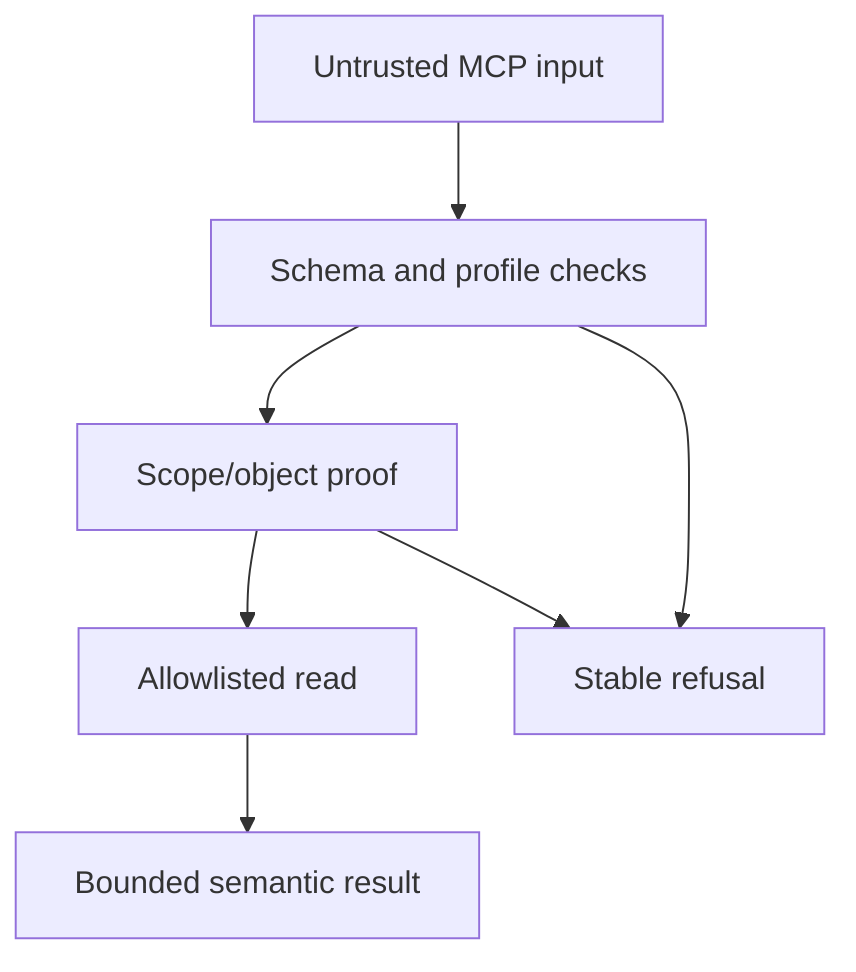

# Threat model

| Threat | Boundary/control | Residual verification |
| --- | --- | --- |
| Model supplies a cabinet or physical Attribute ID | Semantic schemas, raw-field rejection, scope registry | Add a regression test for every new public field |
| Model supplies an arbitrary physical content label | Semantic alias grammar, per-scope registry resolution, no raw `{ns,name}` input | Qualify configured aliases against the live scope policy |
| Model reaches a mutation or admin operation | TypeScript and Java read-only allowlists; invariant tests | Review any allowlist change with security ownership |
| DNS rebinding or browser-origin abuse | Host and Origin hostname validation | Configure deployment hostnames explicitly |
| Token theft or overbroad client access | Hashed tokens, profile scope/tool lists, rate limit | Rotate secret files and review profiles |
| Oversized MCP or adapter response exhausts memory | Content-Length precheck, streaming byte bounds, bounded config maxima | Exercise limits with slow/chunked responses |
| Adapter redirect leaks an internal token | Redirects disabled on gateway-to-adapter requests | Keep the adapter on a private network and test proxy behavior |
| Adapter returns an unexpected object class | Scope `allowed_object_types` checked on every result | Review object-class mappings against the licensed schema |
| Adapter returns an object from another cabinet/root | Returned object and path IDs are checked against the selected scope; root membership is revalidated | Keep scope mappings non-overlapping and test adversarial adapter responses |
| CI dependency reference changes unexpectedly | GitHub Actions are pinned to full commit SHAs; Dependabot tracks updates | Review action/image updates as supply-chain changes |
| Session identifier leakage | Java-only session lifecycle; redaction; no session tool fields | Inspect logs and MCP fixtures for session strings |
| Binary or malicious content reaches an LLM | Extractor allowlist, bytes/characters bounds, no base64 | Qualify real formats in a controlled environment |
| XML entity or archive attack | DTD/entity rejection, safe XML parser, archive limits | Add format-specific fixtures before enabling an extractor |
| Temporary content persistence | Shared-directory check and `finally` cleanup | Monitor volume permissions and cleanup failures |
| Label membership or returned label is confused across namespaces | Exact `ns` + `name` proof in `system:contentlabellist`, adapter response identity check, namespace-safe cache key | Exercise revision/reference behavior in a licensed environment |
| Content cursor is replayed across labels | Signed semantic `content_label` binding plus profile/scope/document checks | Keep cursor TTL short and rotate HMAC keys as required |
| Upstream fault leaks private details | Stable error mapping and bounded adapter messages | Test representative licensed-service faults |
| SSRF through an MCP client or proxy | Endpoint is server configuration; deployment network allowlist | Review reverse proxy and client egress rules |

## Abuse sequence

The model cannot skip from input directly to SOAP. Every read crosses the
semantic scope and operation boundaries.
